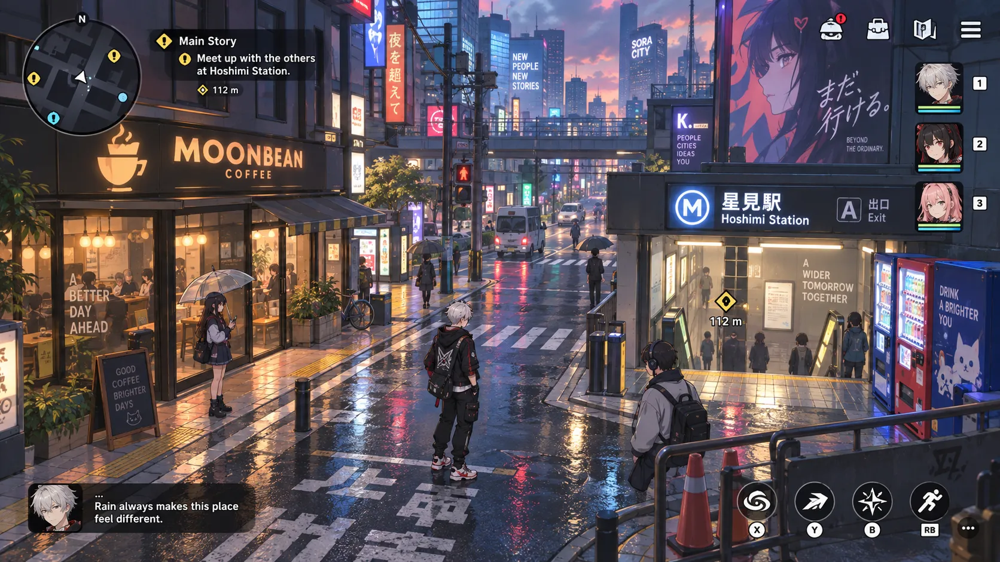

# N:SIDE



在 Null City，兄妹与家庭 Agent 共同经营一家生活杂货店，在都市日常中调查异常、潜入梦境，帮助当事人重新回到生活

核心体验是“我真的在 Null City 生活过一段时间”。项目采用清爽、通透的日系现代都市表达

首发支持 PC，系统为 Linux 和 Windows，输入支持手柄和键鼠，图形接口采用 Vulkan

## 入口

[Wiki 源文档](docs/index.md) · [项目愿景](docs/vision.md) · [开发任务](todo/README.md) · [Agent 入口](AGENTS.md) · [游戏工程](game/README.md)

## 本地 Wiki

```sh
bun install
bun run docs:dev
```

[Wiki 构建与预览](docs/production/wiki.md) · [检查工具](tools/README.md) · [目录约定](docs/conventions.md)

## 游戏开发

当前工程使用 Rust 2024 与 Bevy 0.19.1，从 `game/` 启动：

```sh
cd game
cargo run --locked
```

格式、编译、测试与构建命令见[游戏工程](game/README.md)

## 许可证

[Mozilla Public License 2.0](LICENSE)
