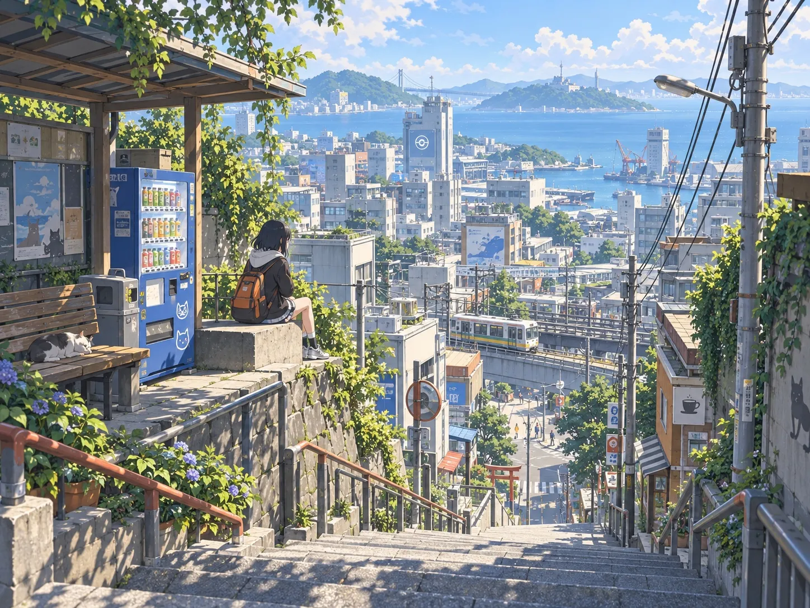
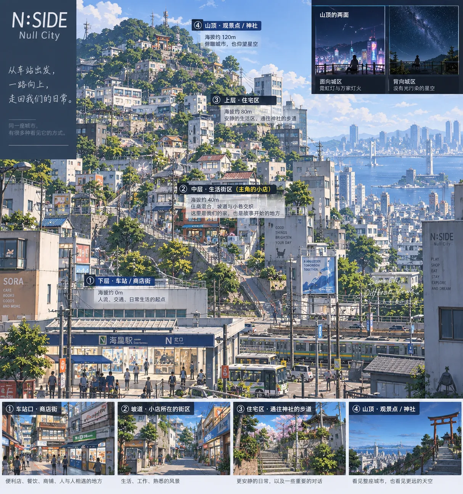

# 美术

## 视觉方向

以有生活基础的动漫化现代都市为核心，轮廓清楚、图形鲜明、材质克制，近看能辨认经营、使用和维护留下的痕迹。青年兴趣文化与普通居民生活共同构成街景，坡路、绿植、屋顶和远处河面保持清爽的空间层次

人物采用动漫化造型，环境以可信的建筑比例、简化的材质细节和经过组织的色块承接人物。视觉重点依次为地点轮廓与入口、经营图形与陈列、近处生活细节，人在移动中能够认出目的地

白天、黄昏、夜景和雨后共同构成完整游戏的城市面貌，天空、树影、店灯和水面承接散步、停留与回家的情绪。小机器人以表情、姿态和即时反应体现共同生活的熟悉感

人物造型依据各角色档案，空间关系依据各地点与[街区建筑](district-architecture.md)，源坐标、轮廓与高程决定实际尺度

## 建筑与街面

先用建筑大轮廓、屋面与高差组织远景，再用首层界面和转角识别街段，最后在停留处安排细节。门、橱窗、住宅入口、雨棚和设备使用一致的米制比例；重复窗带跟随实际楼层，坡地建筑的各层保持水平

较宽的首层界面通过门口、橱窗、立柱、招牌与收口形成节奏。店铺、住户和后勤入口各有朝向与辨识，临街经营集中在公共来路，背面以收货、维护与私人生活表现使用关系。天井、公共台阶、侧巷与屋顶平台按空间设计保留开口

| 区域 | 主要表现 | 细节组织 |
| --- | --- | --- |
| 小店与采购街 | 亲近的商住界面、连续橱窗、雨棚与错台 | 商品陈列和菜单靠近店门，住宅层较安静，货运侧院体现验收与转运 |
| 站前与兴趣街 | 较完整的都市体量、清楚的入口与鲜明经营图形 | 信息牌、设备展示、作品橱窗与会合位置建立不同店铺的身份 |
| 影院与音乐街 | 公共入口、前场和上层平台构成场所轮廓 | 海报、场次或演出信息集中在到达方向，器材搬运留在服务侧 |
| 住宅与校园 | 稳定的窗带、院门、绿化与明确边界 | 门牌、自行车、养护物件按使用位置出现，导向服务实际入口 |
| 河岸与山路 | 岸线、桥体、树冠和天空形成长距离层次 | 座位、护栏与路灯集中于通行和停留节点，观景方向保持开口 |

## 图形、招牌与颜色

每个重点店面先确定一个主识别图形、一组主辅颜色和一处主要招牌，再组织橱窗及小标识。大字、色块、几何图案、插画与商品形象共同表达经营内容；菜单、价格牌和告示在走近后提供第二层信息

正面招牌面向主要来路，侧向招牌帮助转角识别，住宅门牌与服务标识保持各自尺度。重点店铺可以采用醒目的商品装置或夸张图形，普通店铺通过材料和陈列形成差异。所有图形使用项目原创内容或已明确授权的素材

建筑大面以暖灰、米白、冷灰及低饱和自然色建立连续基底，强调色集中于店面、设备和导向。相邻店铺共享环境基调，主识别色与图形形状形成区别；选择高饱和色时同时控制面积和邻近对比

从街道方向看入口是否清楚，再检查人眼高度下的招牌与陈列。把画面缩小或转为灰度后，主要入口、建筑层次和路径仍应可辨

## 材质与构件

材质以大面颜色、粗糙度和少量结构性细节区分灰泥、混凝土、金属、木、玻璃与铺地。表面使用痕迹集中于门把、台阶边、搬运接触面和设备接口等有原因的位置，减少覆盖整面的高频污渍和随机划痕

首批技术样板采用标准 PBR，统一曝光、纹理密度和材质反差，以实际镜头判断是否需要进一步的动漫化渲染。角色的明暗表现与环境分别验证，环境的立面、铺地与植被先通过几何、材质和光照建立整体观感

公开模型按构件选择并统一材质，整栋建筑的比例由地图外轮廓与高度确定。门窗沿立面按实际尺寸排列，余量由墙面收口；贴图按米重复，较长墙面通过增加重复次数保持纹理尺度

运行资产的基线为米制 GLB 与标准材质，导出时核对朝向、枢轴、法线、UV 和透明边缘。落地道具以底面为放置基准，墙面构件以贴附面为基准；常规道具贴图先用 1K，共享建筑与地表材质先用最高 2K，在近景样板中验证后调整

## 植物与生活物件

树木以清楚的树干和成组树冠形成树荫及视线边框，叶片细节服从中近景轮廓。植被采用少量统一类型，通过高度、冠幅与受控颜色变化表现街树、院内绿化和山林的差异，保留 N街区初秋的季节气质

物件成组表达具体活动：店门旁是陈列与等候，后场是验收与维修，住宅边是养护与日用品。每组有主要物件、辅助物件和留出的活动空间；设备具有可理解的安装、供电和维护位置

轻近未来设施与仍在使用的旧物并存：信息屏、自助设备和家庭 Agent 表达当下技术，收音机、修过的工具、唱片与旧陈列架表达各家店的经历。新旧差异通过造型、接线和维护方式呈现，具体物件随经营内容选择

优先使用地图已有树点和设施位置。表现补充通过源对象锚定，装饰避开入口、连续通道、台阶落脚处和既定观景方向；改变遮挡或通行的布置进入空间设计核对

## 光照与取景

白天以明确的主光方向、可读的阴影和稳定的环境补光组织体量。亮面保留材质颜色，阴影中能辨认入口、路缘和台阶；玻璃、金属与水面的反射服从街景层次

远景检查坡地、城市轮廓、桥梁与河面的关系，中景检查街面和转角，人眼高度检查门窗、铺地及生活物件。近景尺度比较使用固定视场角，采用相同位置和光照比较外观版本

树影、雨棚与店内浅景增强街面深度，雾和景深按取景需要克制使用。地形接缝、平台支撑与建筑背面在正常白天光照下保持可检查

## 人物与界面协调

人物的头身比例、服装大形和关键识别色由角色档案确定，环境在入口、对白和停留位置为人物轮廓留出清楚背景。小机器人的表情与姿态在普通街景距离下可读

界面保持文字、信息层级与交互状态清楚，环境内的招牌、信息屏与海报按场所用途设计。世界中的平面图形和操作界面共享色彩纪律，各自服务经营识别与操作阅读

## N街区空间参考

参考高低差、树影与远眺水面的空间感，N街区采用更缓的坡度，以维持日常通行与客流

概念图说明车站、生活区与山顶的构图和氛围，街面、服务通道、滨水分层、声音与取景要求见[街区空间制作](district-space.md)，具体尺度、入口和路线由同源空间数据与实际镜头共同核对

## 制作

需求 → 概念 → 技术样板 → 源文件 → 导出 → 接入 → 场景检查

技术样板记录单位、比例、朝向、材质、透明表现、动画组织与碰撞。交付包括源文件、导出文件、依赖素材、来源与导出方法，资产关系进入清单

资产在统一标尺、光照下检查尺寸、朝向、材质和透明表现，再放入街景检查风格、遮挡与使用关系。来源、许可和派生关系遵循[资产管理](assets.md)

在实际镜头下检查轮廓、遮挡、交互辨识、动作同步、昼夜效果与资源成本。近景样板应同时具备可辨认的店面、合理的材料尺度、完整的侧后立面和清楚的公共通路，随后用同一套构件和材料规则扩展相邻街段
