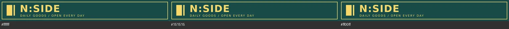

# 既有招牌资产工作样板

输入为 AST-004 的原创 shop.svg 和已导出 shop.png。先读取 nside 适配与 create-game-assets，再沿资产包的既有来源与导出关系执行检查；本轮不调用生图、不改动运行素材

## Brief 与实际操作

用途是现有 V-04 小店招牌；原 PNG 1024×128，512×64 为保持 8:1 宽高比的半尺寸阅读样本，不是新确定的世界尺寸或屏幕预算。保留字形、深绿色底、金色边框和透明边缘，只输出临时对比图

```fish
python3 -B .agents/skills/create-game-assets/scripts/asset_report.py game/assets/environment/signs/shop.png --expect-size 1024x128 --require-alpha --json
python3 -B tools/asset_preview.py game/assets/environment/signs/shop.png --display-size 512x64 --require-cutout --out output/assets/restructure/shop-contrast.png
bun tools/export-district-scene.mjs --check
```

## 机器结果

PASS：PNG 1024×128 RGBA，alpha 6..255，251 色；本资产没有已批准色数预算，因此不自行填写限制。cutout 检查和三底色预览通过，10 个现有导出图逐字节一致；源 SVG 与运行 PNG 对审查基线无变化，hash 见 asset-inputs.json

## 视觉自查

已实际打开源 PNG 与 output/assets/restructure/shop-contrast.png。512×64 的主名称和边框连续，浅色、深色、洋红底未见新增明显灰边或裁切，次级英文比主名称细小；此观察仅覆盖静止预览



机器报告中的 visual_review 保持原始 NOT RUN，人工自查在本段单列。未修改游戏行为或素材，本轮不重复录像；既有 Viewer 录制不升级为人物、玩法或新游戏内资产验收。旧记录发现的 8:1 源图与场景牌面比例问题仍为未决视觉问题，本次不越界修图

## 写回与承接

透明通道存在与边缘可用分开检查，实际显示尺寸与缩放样本分开记录，这两项写入资产制作手册。来源与 brief 留在 AST-004 既有资产包，任务验收只表示工具处理与文档样板成立
