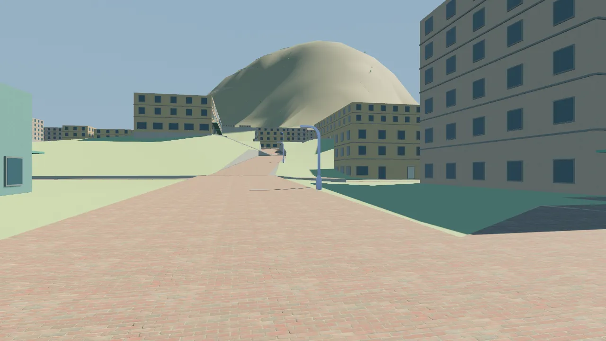
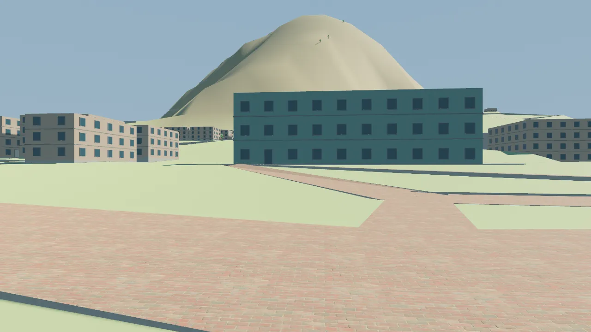
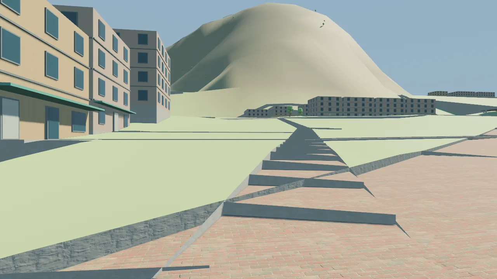
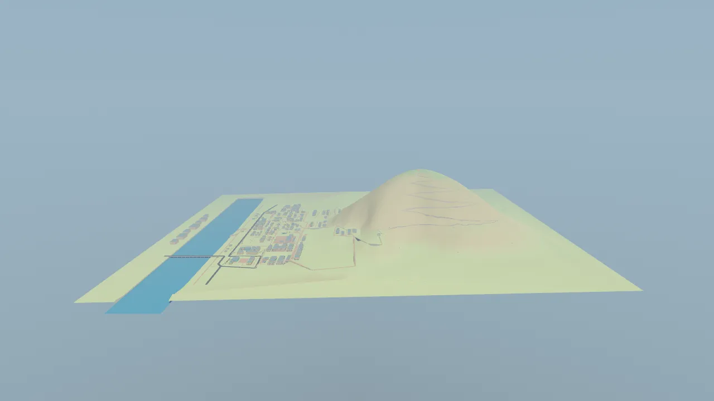
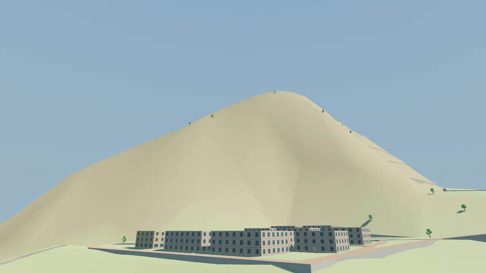
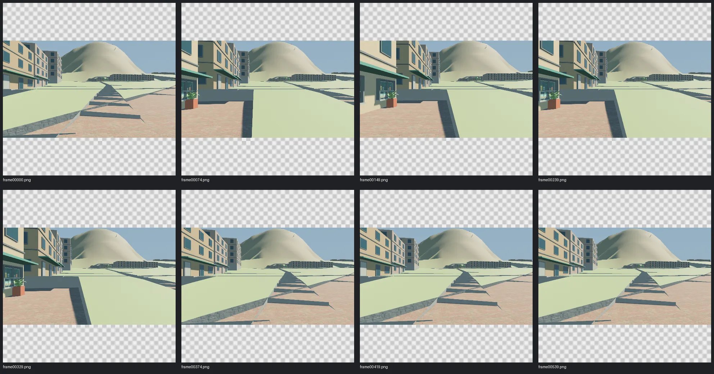

# 单峰山城灰盒：第2轮交付与验收范围

本轮依据作者的实际反馈取消双峰，摘星台设为相对白沙河水面 +450m 的最高点，小店至山脚收紧；不改变建筑层高、稳定对象 ID 或剧情。参考图与用途见 [reference.json](reference.json)，数值与源保护检查见 [geometry.json](geometry.json)。旧双峰方案及其技术检查保留于 [r1](../r1/review.md)，不作为本轮视觉通过依据

## 已落地

- 小店至山脚直达路线约460m、净升62m，上街至山脚用公共台阶分配高差；站前回家、采购及镜厅三条缓行替代路线仍逐段不超过5%
- 摘星台与最高地形点重合，站前平距约1173m，从1.7m人眼看峰顶的几何仰角约20.58°；前期双峰版为约13.46°。建筑自身高度和楼层相对偏移保持，镜厅低街至屋顶仍为12m
- 山体用手工最高点、非对称山肩与沟谷组织大形，以固定种子梯度噪声的两个频率、域扭曲和距离约束补充自然起伏；道路、建筑、平台和源控制点优先。实际地形种子来自 `terrain.bake`，capture 的 seed0 只记录无运行时随机行为的录制条件
- 离线生成器重建 `terrain.samples` 的生成后缀，Wiki 与 Viewer 共用同一源；未引入运行时生成器、另一套地图或新依赖
- Wiki 总图根据真实地形范围取景，色阶覆盖450m；新增河岸至摘星台横纵等比例剖面，与实际道路里程剖面分开

## 实际命令与结果

| 命令 | 结果与边界 |
| --- | --- |
| `bun test tools/tests` | PASS，104项，包含32项地图与3项地形工具检查 |
| `bun tools/terrain-shape.ts --check` | PASS，只读核对；独立探针检查内容及mtime不变 |
| `bun tools/terrain-shape.ts --invalid` | 预期FAIL，退出1，未写地图 |
| `bun run tasks:sync`、`bun run tasks:check` | PASS，18张任务卡；重复生成无漂移，check内容与mtime不变 |
| `bun run check:types` | PASS，TS与Vue类型 |
| `bun run check:docs` | PASS，Markdown、对象ID、引用与31个Skills |
| `bun run check:story-design` | PASS，故事/角色/场所数据与关系 |
| `bun run docs:build` | PASS，player与dev分别构建并检查发布边界 |
| `cargo fmt --manifest-path game/Cargo.toml --check` | PASS |
| `cargo test --manifest-path game/Cargo.toml --features viewer --locked` | PASS，13项库测试及2项Viewer测试 |
| `cargo clippy --manifest-path game/Cargo.toml --all-targets --features viewer --locked -- -D warnings` | PASS |
| `cargo build --manifest-path game/Cargo.toml --features viewer --bin map_viewer --locked` | PASS |
| `python3 tools/capture.py --script game/capture/mountain-city.json --output output/terrain/2026-09-27/verified-tour --binary game/target/debug/map_viewer` | PASS，18秒、960×540、30fps、540张连续帧，含位移、观察、释放和恢复断言，生成MP4 |
| 既有 `game/capture/assertion-failure.json` 同一入口录制，输出 `verified-expected-failure` | 预期FAIL，退出1，1000m位移要求未被伪造满足 |

最后平台边界修复后重新运行工具全测、地形一致性、类型检查、双站构建及15项Rust测试；最终地图SHA256为 `784ef145fb231712faa433d3ea6e9c35e73ddd3a0a03c839218d6d278ba93ba0`，包含39个手工点与809个生成控制点。录制期间HEAD为 `85f2ecb9ae27339e3556445419f1e1928dcc378c`，其TypeScript配置提交原样保留

日志在 `output/terrain/2026-09-27/`，最终重拍输出使用 `verified-*` 前缀，早期 `final-*` 保留为边界修复前的比较记录，捕获参数、状态断言与原始记录hash见 [capture.json](capture.json)、[tour-run.json](tour-run.json) 和 [tour-state.json](tour-state.json)。独立CLI失败与幂等检查见 [independent-review.md](independent-review.md)。图形运行使用Linux、Vulkan、RX6650XT/RADV；沙箱中设备不可见，正常宿主授权后执行同一命令

## 看图自查

这是已读源码和设计后的 self-audit，没有把生成截图当作自动视觉通过，也未冒充陌生玩家试玩。三个街道视点均为既有公开道路节点上方1.7m、55°视场、水平朝向峰顶方向；没有缩放竖向坐标。第一轮曾抬头对准峰顶，不宜直接把两轮PNG当成同机位视觉对照，实际高差与距离另由源数据计算

已看站前、镜厅前街、小店门前、山侧与整体侧视；连续录制检查帧0、74、149、239、329、374、419、539，以及观察开始的连续帧90—93。视频已生成，本轮以关键帧和连续帧查看，没有播放整段MP4













街道视点能看见唯一主峰高于中景屋顶，左侧山肩与沟谷打破原先的对称圆丘。横移与观察中山体保持连续；Esc期间输入未继续移动，恢复后实际控制器继续工作。早期三角巨崖来自高位步道的错误空间间距，已重排；规则同心横线则改为沿东西山肩及背坡横切。最终侧向检查还发现山脚平台角部被地形插值抬高约14.6m；生成器现补精确地面边界控制，真实三角网的16个边缘取样点均回到90m，修复后重拍确认尖突消除

## 保留的限制与下一动作

当前是尺度与轮廓灰盒，裸坡材质、稀疏植被和台地生活细节尚未达到作者参考图的表现品质。登山路线约4.73km、净升360m，其中较陡短段使用实际台阶；尚未以人物实际移动速度验证耗时、休息节奏或快捷通行，需要后续人物原型与真实反馈

Windows图形启动、手柄、人物碰撞、NPC导航、登山完整人工游玩、夜间两面景观和Wiki浏览器交互均为NOT RUN。本轮不新增这些玩法，也不把截图或道路图连通计作可玩闭环完成。旧有 `cinema_upper_platform` 一处支撑布置Warning仍保留，未在本轮宣称完整建筑结构验收

TASK-023保留review，下一动作是作者在相同视点判断山体高度、街坊上升与水平紧凑程度；本轮不放行G1或继续推进玩法路线图

从仓库根用fish可直接启动：

```fish
cargo run --manifest-path game/Cargo.toml --features viewer --locked --bin map_viewer -- --project-root . --view eye-shop-mountain
```
