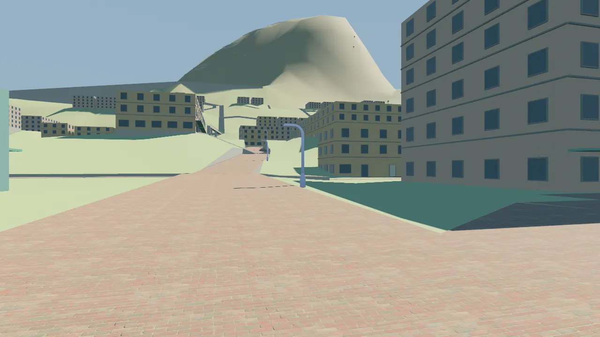
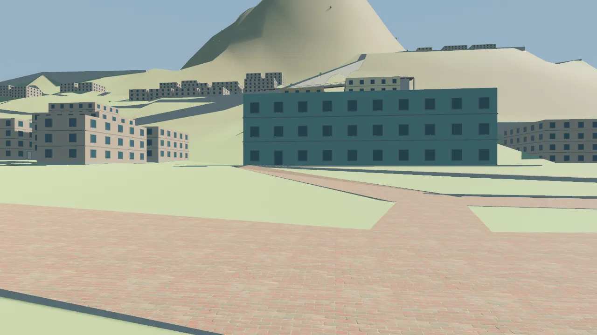
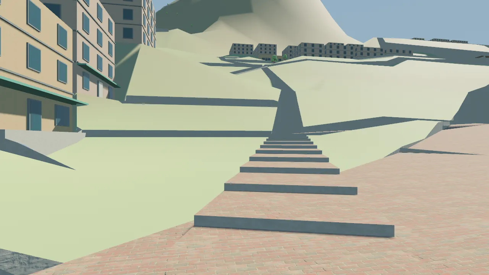
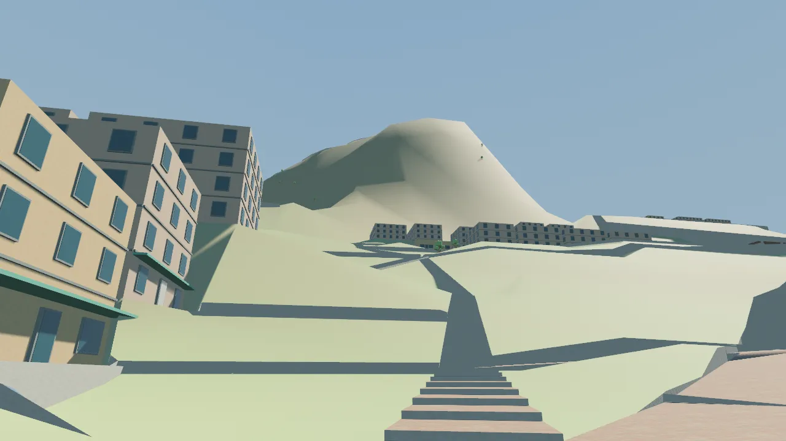
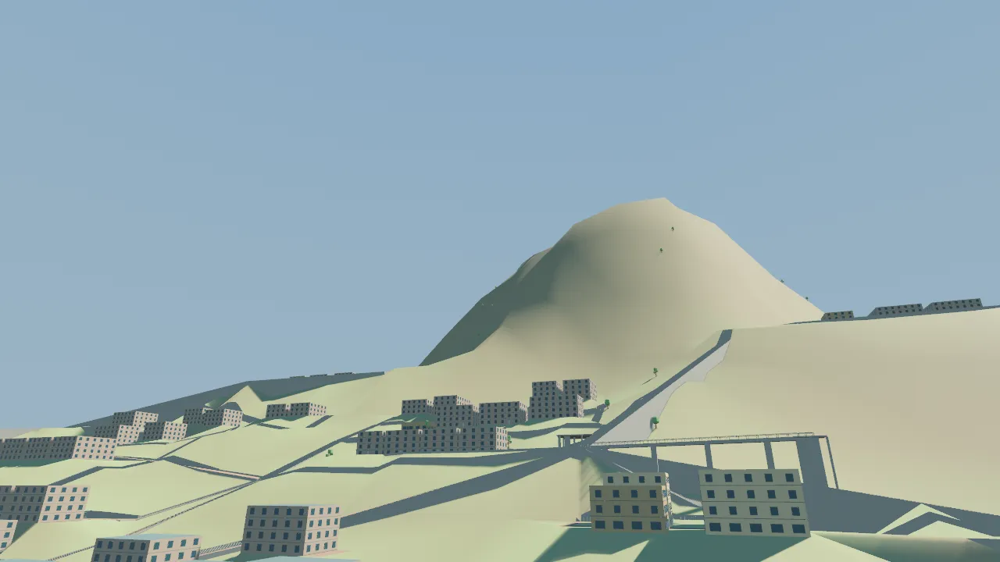
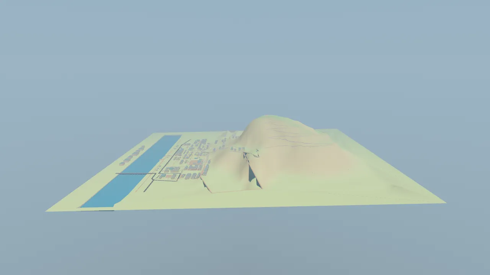
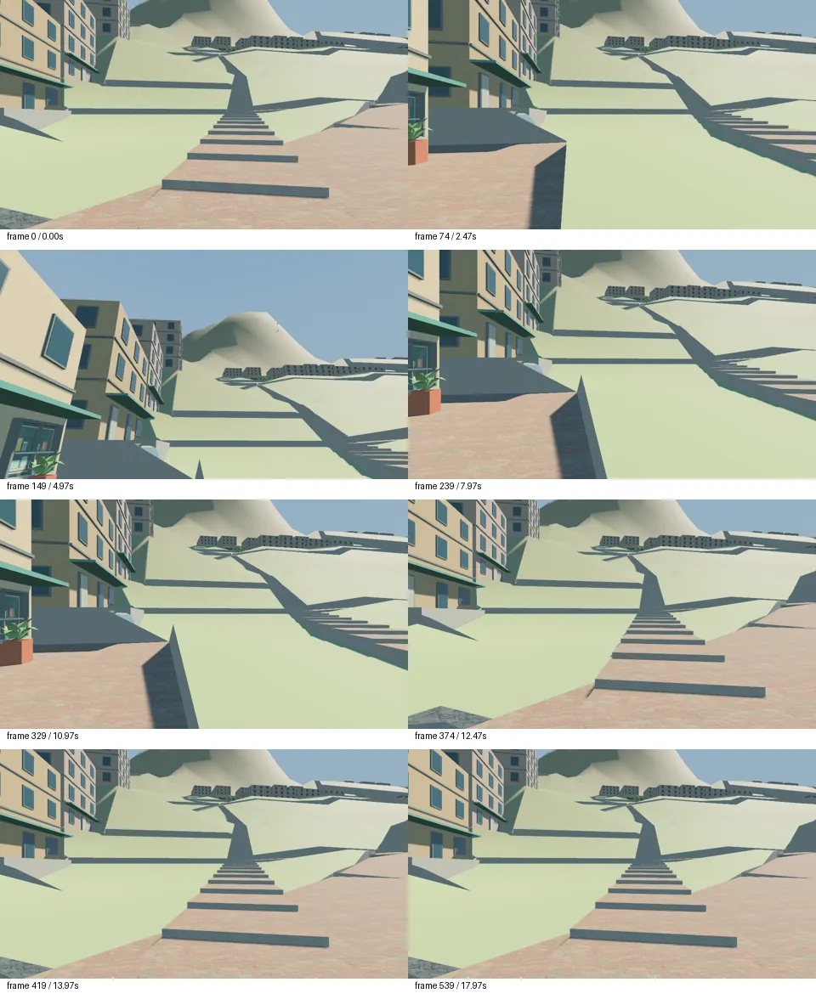
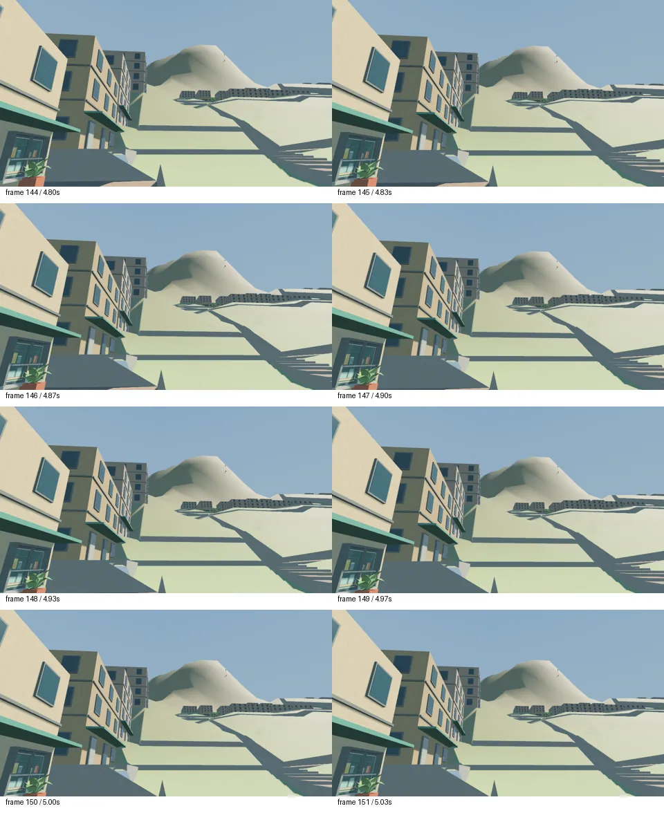

# 小店起坡与整体山城参照：第3轮交付

输入为作者连续补充的“小店开始起坡”“数值只作参考，允许人工改造及较缓过渡”“完整参考长崎，包括地形与城市”。基线为 `c9cd5e7c6a0202b6e0aabfafe03f1e7261e36307`，上一轮 [r2](../r2/review.md)保留历史范围，不作为本轮品质通过依据。参考来源与查阅范围见 [input.json](input.json)

## 本轮落地

- 小店仍为 +28m，后方100m、200m实际地面分别约 +54.39m、+90.24m；摘星台移至 `[230,950,450]`，保持唯一最高点。河岸起算的地标折线剖面约1.179km，小店至峰顶平距约707m；道路里程与这些平距分别计算
- 住宅台地按空间分组抬升，近店允许缓过渡，上层住宅进入山腹；林缘入口约 +170m。建筑自身高度及相对楼层全部保留，影院、坡地、学校、东侧的局部垂直关系仍为12／6／15／26m
- 原有231个建筑、91个场所、12街坊、58地块及全部旧ID保留，66栋只调整基底，V-22神龛为保持登高路线接续作等尺寸平移。新增后勤16m升降连接，以及镜厅上街37→72.32m的公共／后勤分开连接；它们目前是实际图路和空间几何，不是可操作电梯系统
- 三条地面缓行路线的节点与坐标未变，逐段≤5%；普通服务车路仍按≤10%检查，更高街坊用实际公共升降连接形成无台阶图路。山径通过折返和真实台阶段分配爬升，不以改道路名称掩盖坡度
- 地形生成范围延伸到小店后，扩大控制点过渡范围，保留39个手工点并生成补充点，总计1345个；Wiki与Viewer继续读取同一份主数据
- 正式城市设定与制作规范加入低地／谷地中心、山腹住宅、公共交通接点、人工宅地、沿坡横街、短台阶、维护和滨水生活的整体关系，来源汇入城市研究R15。当前白沙河两岸设定继续有效；已询问是否引入河口港湾，尚未收到选择

数值、对象保护、全部新节点与路线结果见 [geometry.json](geometry.json)。城市整体参照已经成为设计要求；全城街坊尚未逐一按这些要求完成场景细化，不将新增设定算作完成城市制作

## 实际验证

| 命令／操作 | 结果与范围 |
| --- | --- |
| `bun test tools/tests` | PASS，104项；包含32项地图、3项地形检查 |
| `bun test tools/tests/district-map.test.ts` | PASS，32项；补入原有垂直设施不随整体山体拉伸的回归后复验 |
| `bun tools/terrain-shape.ts --check` | PASS，生成数据与源一致 |
| `cargo fmt --manifest-path game/Cargo.toml --check` | PASS |
| `cargo test --manifest-path game/Cargo.toml --features viewer --locked` | PASS，13项库测试、2项Viewer测试 |
| `cargo clippy --manifest-path game/Cargo.toml --features viewer --all-targets --locked -- -D warnings` | PASS |
| `cargo build --manifest-path game/Cargo.toml --features viewer --bin map_viewer --locked` | PASS |
| `bun run check:types` | PASS，TypeScript与Vue |
| `bun run check:docs` | PASS；初次发现2处R15锚点拼写不一致，修正后复验 |
| `bun run check:story-design` | PASS，37人物、91场所、22故事及关系 |
| `bun run docs:build` | PASS，player／dev分别构建及发布边界检查 |
| `bun run tasks:sync`、`bun run tasks:check` | PASS，生成稳定、check只读，详情见 checks.json |
| 6个固定视点经 `tools/capture.py` 真实录制 | PASS，1280×720，每处2帧 |
| `python3 tools/capture.py --script game/capture/mountain-city.json --output output/terrain/2026-09-27/r3/review-tour --binary game/target/debug/map_viewer` | PASS，18秒／30fps／540连续帧／MP4；横移、抬头、释放、恢复与稳定性断言 |
| 同一入口运行 `game/capture/assertion-failure.json`，输出 `review-expected-failure` | 预期FAIL，退出1，真实移动约11.6m未满足刻意设置的1000m条件 |

日志和大体积产物在 `output/terrain/2026-09-27/r3/`；捕获参数、状态与hash见 [capture.json](capture.json)、[tour-run.json](tour-run.json)、[tour-state.json](tour-state.json)、[failure-state.json](failure-state.json)。最终地图SHA256为 `6e422a6fc658e4d62ad6326d073dd01b01783b4a29a3603ee0a88c19a7a50535`，二进制SHA256为 `88144ed2c30b3f013d7b42885beec8b453d90f0095c8c224089a8d2e4809de19`；运行发生在上述基线加本轮未提交改动上

图形运行使用Linux、Vulkan、RX6650XT/RADV。沙箱内图形设备不可见，按授权在正常宿主执行相同入口；未变更引擎版本、运行依赖或图形API

## 画面自查与未通过项

以下为已读设计后的self-audit。实际看过站前、镜厅、小店水平、小店仰视、山侧及全局侧视，并查看录制关键帧0、74、149、239、329、374、419、539和连续帧144—151；没有播放整段MP4，没有独立盲审或作者实机试玩。自动run.json保留原来的视觉NOT RUN标记，本节单独记录人工看图范围

站前、镜厅、小店的水平视点仍是道路节点上方1.7m、55°视场、不缩放竖向坐标。新视点 `eye-shop-uphill` 在同一位置显式上仰20°，水平看时近处山顶超出画面是正常结果；录制用真实鼠标look输入抬头观察，不把仰视截图冒充水平视野

















小店后方起坡、住宅逐层抬升与唯一最高点的空间关系已经可见。前期将旧高程统一放大的草稿产生大切坡与百米级局部设施高差，已否定；当前版本恢复原有设施尺度，按空间分组调整宅地。最终图仍有大块裸坡、局部尖长切坡／挡墙、重复住宅体量和稀疏植被，尚未形成参考图或长崎街景中的密实生活界面，这些表现问题未通过品质验收

运行同时保留4条[平台支撑警告](support-warnings.json)：`slope_upper_platform`东边2处、`cinema_upper_platform`1处、`upper-transfer-landing`西边1处，自动柱位搜索未找到不占通路的位置。其中影院为旧警告，另3处随抬坡与新增平台出现：坡地平台东缘位于6m宽公共台阶带，新换层平台西缘邻近下层通路，柱不能直接插入通行空间。其余柱位与平台仍生成，受限跨间需要人工梁／井体支撑设计及下层净空复验；本轮未宣称平台结构已验收

当前山径约5.16km、净升422m，较陡短段为实际台阶，其余山径段≤12%。图路连通不能证明5.16km登山的操作与节奏合适，也不能证明电梯交互、人物碰撞、NPC导航或关闭时恢复成立。Windows图形、手柄、人物完整行走、夜景两面效果及Wiki浏览器交互均为NOT RUN

## 后续与复看入口

本轮停在TASK-023的review，未新增G1验收结果。下一次仍处理本任务：优先把“小店—上街—镜厅连接”这一段的大切坡细化成院落、短墙、沿坡小路和植被，再依据同机位画面判断尺度；河口港湾选择另据作者答复处理，不继续推进玩法路线图

从仓库根用fish可直接执行：

```fish
cargo run --manifest-path game/Cargo.toml --features viewer --locked --bin map_viewer -- --project-root . --view eye-shop-uphill
python3 tools/capture.py --script game/capture/mountain-city.json --output output/terrain/local-review --binary game/target/debug/map_viewer
```

切换 `--view eye-shop-mountain` 可看相同位置的水平视野；`eye-station`、`eye-cinema`、`hillside`和`mountain-profile`对应其他已记录视点。人工操作沿用Viewer的M启用、鼠标观察、WASD移动与Esc释放

代码／数据只读复核未发现本轮阻断问题；旧硬编码高度、距离与采样总数上限按新目标调整，坡度、空间交叉、建筑楼层和真实控制器检查继续保留。复杂度评审：Lean already. Ship.
