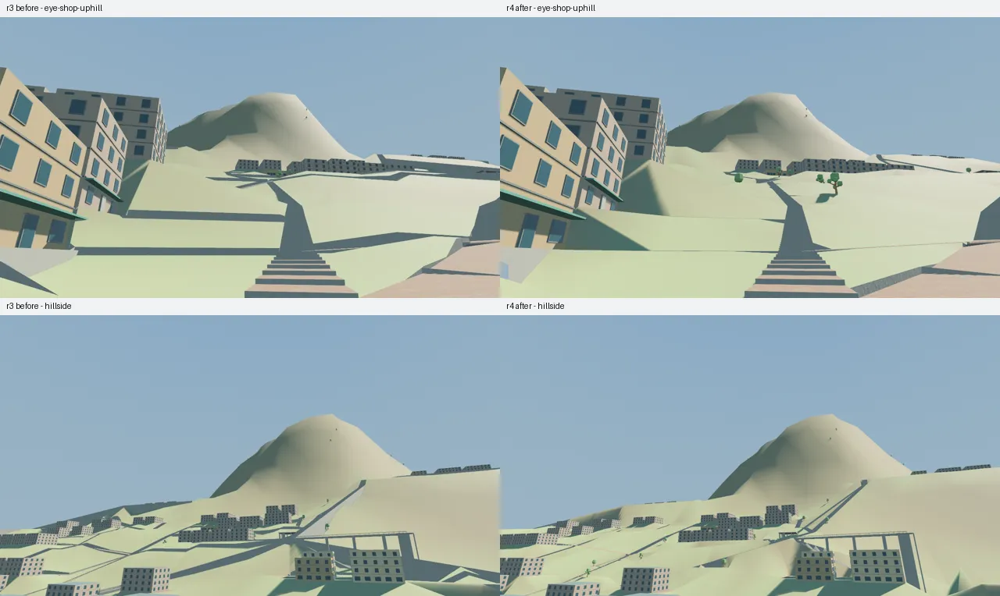
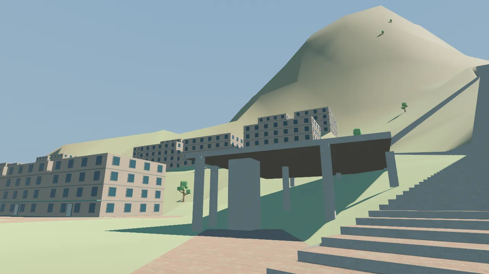
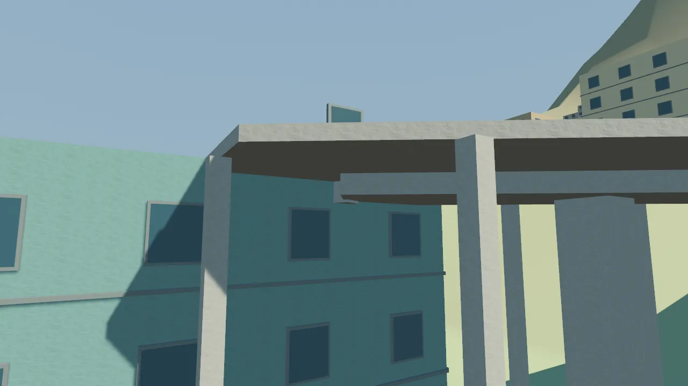
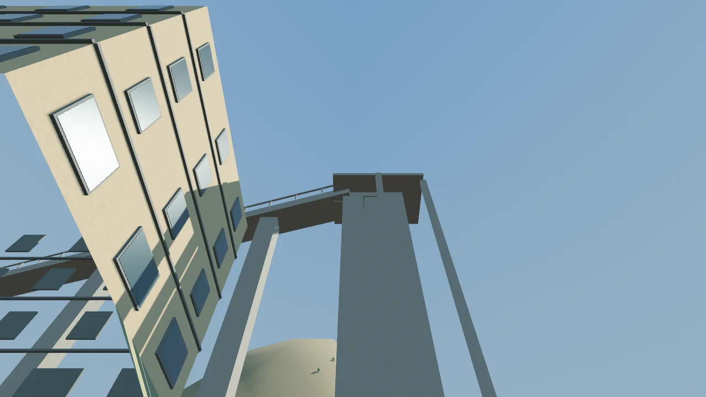
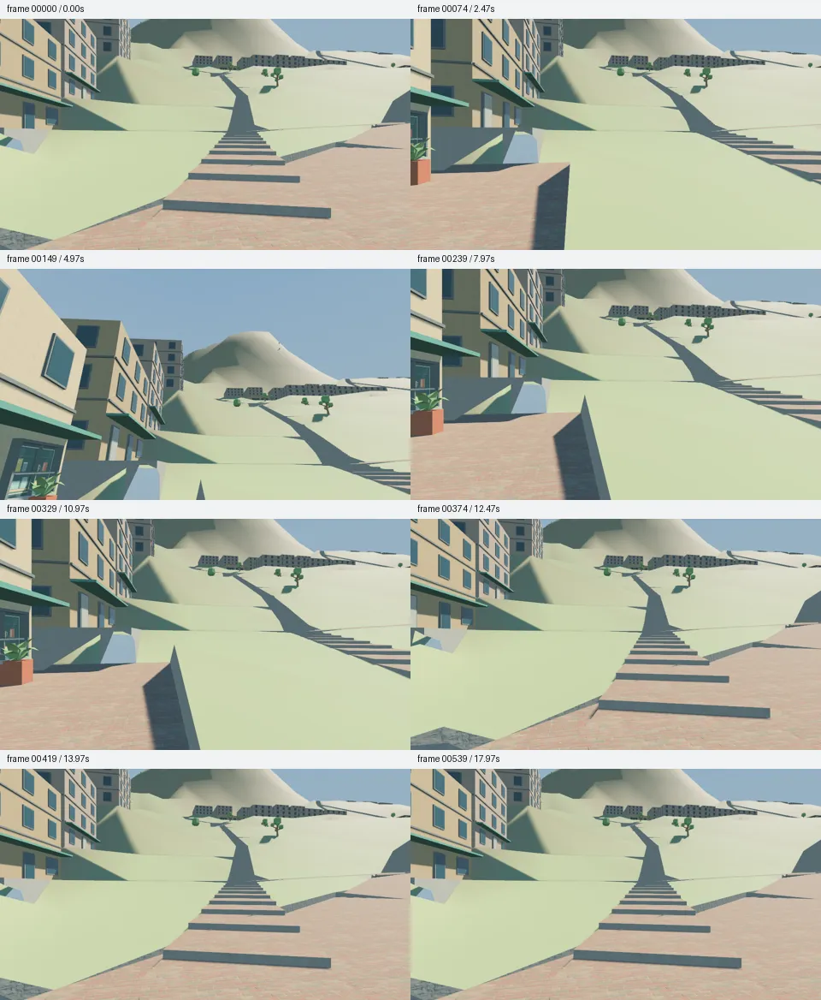
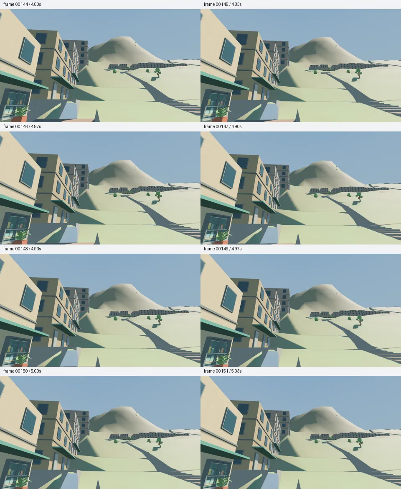

# 坡地街道与平台支撑：第4轮交付

按作者“继续”处理上一轮已经记录的切坡与承托问题，基线为 `8ae11b3164d64e1c026980d9fcc2f3c1a267f3cc`。白沙河、小店起坡、摘星台唯一最高点及既有场所身份保持有效，输入见 [input.json](input.json)。本轮停在 TASK-023 的 review，G1 已验收数仍为0

## 已修复与保留

- 城市坡段补齐台地整条边缘及道路中心、两侧和转角的地形控制；自然山面保留原来的多频形态。8257个总样点含原39个手工点，Wiki与Viewer仍读取同一份地图，不在运行时另外生成山体
- 两处院落边缘此前比场地低9.30m、5.31m，镜厅至学校的一处低街地面此前高出道路10.33m；对应抽样现在与实际场地／路面一致。折线台阶的采样与Viewer转角偏移对齐，已复现的1.780193m额外切坡降至约6e-7m；邻接低街仍有0.574m实际挡边，不把所有上下街差异抹平
- 新增4处与既有台阶相连的停步小台地、4株树；旧1246个节点坐标、231栋建筑、91个场所均保留。当前1255节点、622道路、79表面、72株树；建筑高度、楼层、入口和原3条缓行路线不变
- 上街往学校的台阶改接既有北侧公共横街，避开与镜厅低街在道路宽度范围内的异高重叠。坡平台东侧台阶外绕，并与上山路线共用真实岔口，避免钻入平台和新增异高交叉；原终点与台阶宽度不变，路线及剖面同步更新
- 外部架空平台可显式引用楼体或电梯顶节点承托；当前只在镜厅平台和上街换层平台生成两根短梁。其余边仍寻找真实落地柱位，缺承托仍报告；下层净空采用实际斜路／转角路面及台阶半踏高，保留2.5m灰盒检查值

详见 [geometry.json](geometry.json)、[绕行决策](platform-detour.json)与[最终踏步数值](stair-final.json)。踏步最大高差约0.170m、最短踏面约0.281m，但最长一段仍有534级；这些数值不代表连续行走节奏或人物碰撞已经验收

## 实际验证

| 命令／操作 | 结果与范围 |
| --- | --- |
| `bun test tools/tests` | PASS，104项，含32项地图和3项地形检查；地形重建的两项测试设20秒上限，适应并行负载，几何阈值不变 |
| `bun tools/terrain-shape.ts --check` | PASS，8257样点，与生成器一致 |
| `bun run check:types` | PASS，TypeScript与Vue |
| `cargo test --manifest-path game/Cargo.toml --features viewer --locked` | PASS，15项库测试、2项Viewer测试；包含缺引用、错误承托、受阻短梁与实际转角路面反例 |
| `cargo clippy --manifest-path game/Cargo.toml --features viewer --all-targets --locked -- -D warnings` | PASS |
| `cargo fmt --manifest-path game/Cargo.toml -- --check` | PASS |
| `cargo build --manifest-path game/Cargo.toml --features viewer --bin map_viewer --locked` | PASS |
| `game/target/debug/map_viewer --project-root . --validate` | PASS，2627个几何分组；原4条平台支撑警告为0 |
| `bun run check:docs`、`bun run check:story-design` | PASS，文档引用、Skills、叙事对象与关系 |
| `bun run docs:build` | PASS，player／dev分别构建与发布边界检查；保留Vite大分块体积提示 |
| `bun run tasks:sync`、`bun run tasks:check` | PASS，重复生成稳定，check不写文件，见 [checks.json](checks.json) |
| 9个固定机位 | PASS，各1280×720／2帧；6处沿用上一轮机位，3处检查支撑 |
| `python3 tools/capture.py --script game/capture/mountain-city.json --output output/terrain/2026-09-27/r4/final-tour --binary game/target/debug/map_viewer` | PASS，18秒／30fps／540连续帧与MP4；实际横移约6m、抬头、释放输入、恢复和停止断言通过 |
| 同入口运行 `game/capture/assertion-failure.json`，输出 `final-expected-failure` | 预期FAIL，退出1；实际移动11.60m未达到刻意设置的1000m，失败检查有效 |

最终源SHA256为 `adcca7dc8c081c851f3d5a3914d7aca1cfa794a97229033696622ab66e3b7dfa`，二进制SHA256为 `b8f2e5fc0f22ef8c53b35891c34d0af8274906f59a004e9e64c2c69607674f09`。运行来自上述基线加本轮工作区修改；固定种子与时间步提高复现性，不声明跨GPU像素相同。环境为Linux、Vulkan、RX6650XT/RADV，GPU访问通过宿主正常授权执行

捕获参数、状态与版本见 [capture.json](capture.json)、[tour-run.json](tour-run.json)、[tour-state.json](tour-state.json)及[failure-state.json](failure-state.json)。连续PNG、MP4和完整日志在忽略目录 `output/terrain/2026-09-27/r4/final-*`；本目录保留质量80的WebP、数值及检查摘要

修复前失败保留在同一输出根目录：`rust-before-stair-detour.log`记录严格净空揭示的台阶冲突，`capture-*`是miter修正前的中间画面；`miter-parallel-timeout.log`记录默认5秒测试上限在并行负载下超时，之后增加测试时间预算并完整复验。上述中间结果不作为最终通过证据

## 画面自查

本节为读过设计和代码后的self-audit。实际查看9个最终固定机位、关键帧0／74／149／239／329／374／419／539以及连续帧144—151；未播放整段MP4，不称为盲审或作者实机试玩。自动run.json的visual_review仍保留NOT RUN，本节单独记录看图范围



小店前原先横贯坡面的几条高切边缩小，院落边界不再拉出同样突兀的尖长墙面；新停步台地和树木已经接入实际场景。山体轮廓与小店起坡位置保持原方案；大片空坡、重复楼体、过长直台阶仍然明显，没有达到参考街景的细化品质







坡平台东侧台阶位于平台外，柱位不再落在该台阶带内；镜厅短梁与楼体搭接、换层平台与电梯井连接可见。`eye-slope-support`和`eye-transfer-support`来自真实道路／连廊位置上方1.7m，采用仰视；`inspect-cinema-bearing`明确为自由结构检查位置，不冒充行人街景。当前梁柱是灰盒承托，不代替结构计算、疏散或电梯系统





横移与抬头过程确实改变视野，释放后位置稳定，恢复后返回近似原处；所查连续帧没有发现明显跳变。站前、镜厅和全局视点分别保存在 [站前](eye-station.webp)、[镜厅](eye-cinema.webp)、[整体比例](mountain-profile.webp)；小店仍同时保留[水平](eye-shop-mountain.webp)与[仰视](eye-shop-uphill.webp)证据

## 剩余边界与下一步

没有人物碰撞、可操作电梯、NPC导航或完整登山体验，本轮没有临时伪造这些能力。Windows图形、手柄、夜间两面观景、Wiki浏览器交互与作者实玩均为NOT RUN。现有图路和有限净空检查只覆盖自身定义的几何条件

下一轮仍在TASK-023：把小店后到上街的连续长台阶拆成有停步节奏的街段，细化裸坡、挡墙和住宅前沿，再用相同机位判断密度和尺度；本轮不推进玩法路线图，不改变河流水体设定。代码和采样复核发现的转角差异已修正，复杂度评审：Lean already. Ship.

从仓库根用fish复看：

```fish
cargo run --manifest-path game/Cargo.toml --features viewer --locked --bin map_viewer -- --project-root . --view eye-shop-uphill
cargo run --manifest-path game/Cargo.toml --features viewer --locked --bin map_viewer -- --project-root . --view inspect-cinema-bearing
python3 tools/capture.py --script game/capture/mountain-city.json --output output/terrain/local-r4-review --binary game/target/debug/map_viewer
```

最后一条输出目录需尚不存在，避免覆盖已有证据；Viewer操作沿用M启用、鼠标观察、WASD移动、Esc释放
